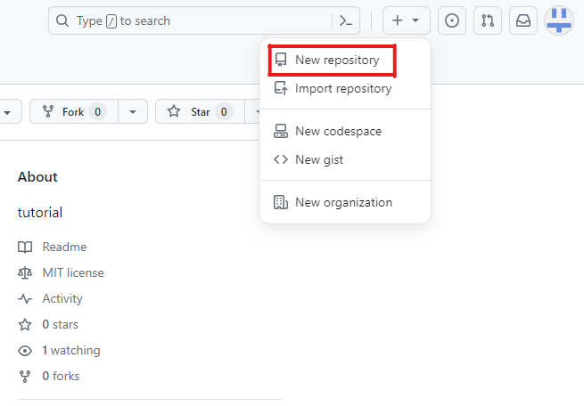
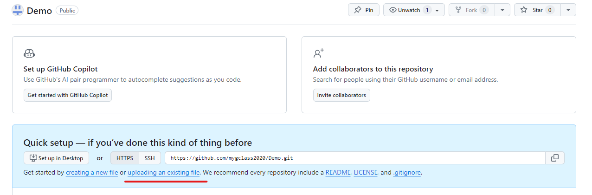
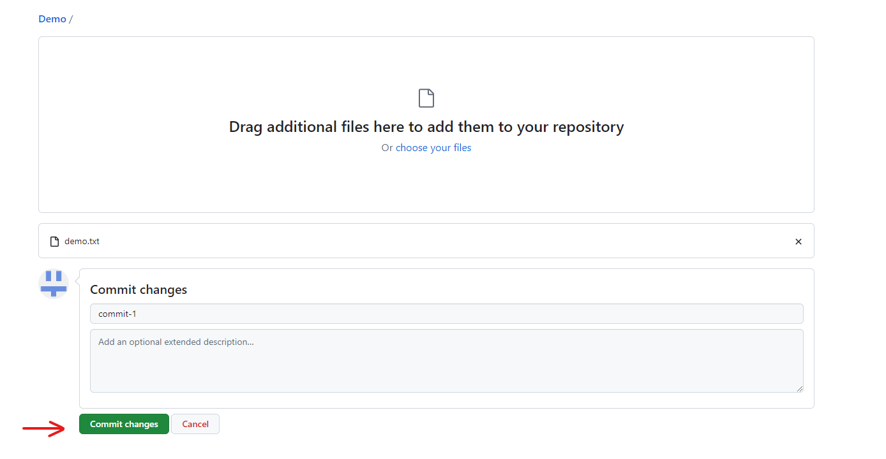
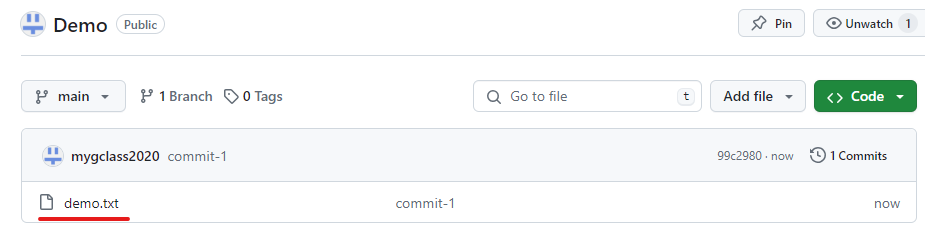
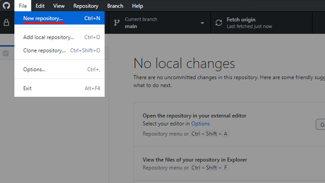
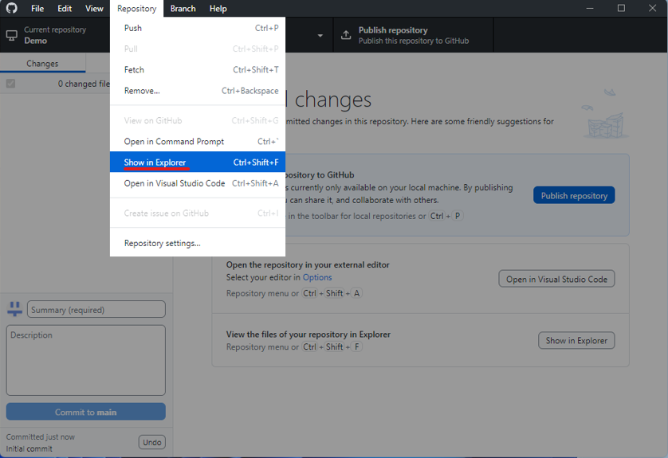
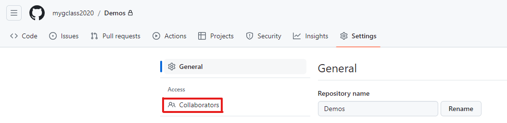
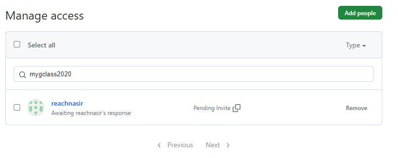
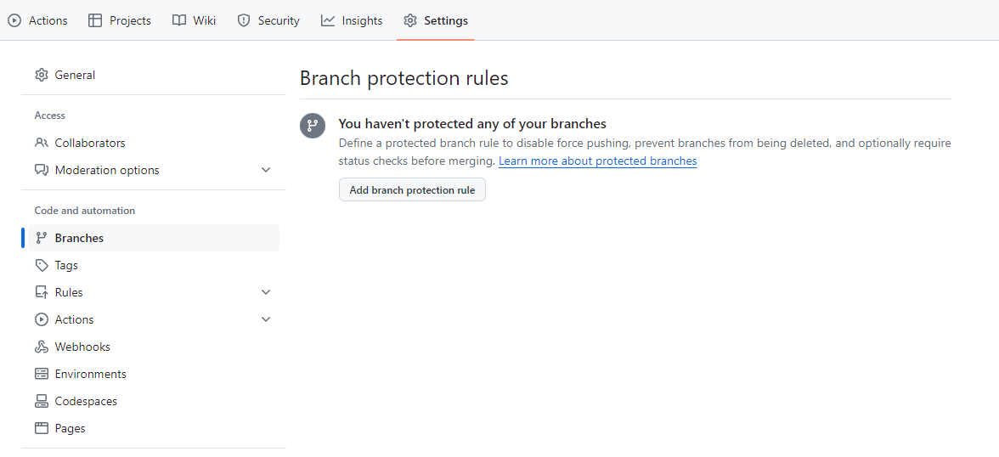
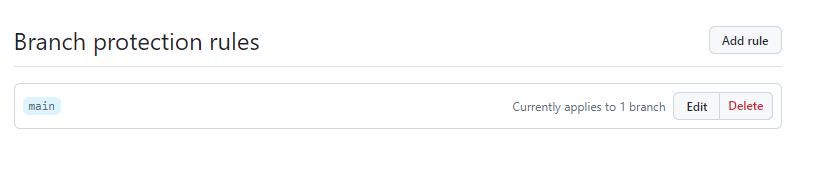

# `Session 1:` Getting started with `Github`

## Date Time: 05-May-2024 at 09:00 AM IST

## Event URL: <>

## YouTube URL: <>

<!--  -->

---

### Software/Tools

> 1. Visual Studio Code
> 1. Github Desktop

### Prerequisites

> 1. Github account

## Information

<!--  -->

## What are we doing today?

> 1. [Learning to create a new repository](#1-creating-a-new-repository)
> 1. [Adding collaborators](#2-adding-collaborators-into-your-repository)
> 1. [Setting Branch policies](#3-adding-branch-policies)
> 1. [Creating a new branch](#4-creating-a-new-branch-and-raising-pr)
> 1. [Creating Pull Requests](#4-creating-a-new-branch-and-raising-pr)

### Please refer to the [**Source Code**](https://github.com/ViswanathaSwamy-PK-TechSkillz-Academy/learn-go-lang/tree/main/src/S1) of today's session for more details

---

---

## 1. Creating a new repository

### For Github website

1. On the top right corner, click on **+** and select **New Repository** from the dropdown

2.Create a new repository following the basic template

3.Select **Upload an existing file**

4.Select your file and commit your changes

5.Your file has been added to your repository

### For Github Desktop

1. On top left corner, select **File --> New Repository**

2.Write a name for your repository and select **Create repository**

3.Go to **Repository --> Show in Explorer**

4.Add your file in the explorer

5.On Github Desktop, commit your changes

6.Go to **Repository --> Push**

7.Click on **Publish Repository**

8.Your file has been added to your repository

## 2. Adding collaborators into your repository

1. Under your repository, go to **Settings**.

2.In the "Access" section of the sidebar, click **Collaborators**.

3.Click **Add People**

4.In the search field, type the name of the person you want to invite, then click **Add Name to Repository**.

5.Invite has been sent to collaborator

## 3. Adding branch policies

1. In your repository, go to Settings --> Branches.

2.In the 'Branch name pattern' write **main** and select 'Require a pull request before merging'

3.Your branch is now protected

## 4. Creating a new branch and raising PR

### For Github website

1. In your repository, select **Branch**

2.Select **New Branch**

3.Write your branch name and select **Create new branch**

4.In your repository, select your new branch

5.Add a file in your new branch and then click on **Compare & pull request**

6.Add a title and click on **Create pull request**

7.Click on **Merge pull request** to complete check in to main branch

### For Github Desktop

1. In Github Desktop, go to **Repository --> New branch**

2.Write your branch name and select **Create branch**

3.Add a file in your new branch and go to **Repository --> Push**

4.Go to **Branch --> Create pull request**

5.Add a title and click on **Create pull request**

6.Click on **Merge pull request** to complete check in to main branch

---

## X. SUMMARY / RECAP / Q&A

> 1. SUMMARY / RECAP / Q&A
> 2. Any open queries, I will get back through meetup chat/twitter.

---
