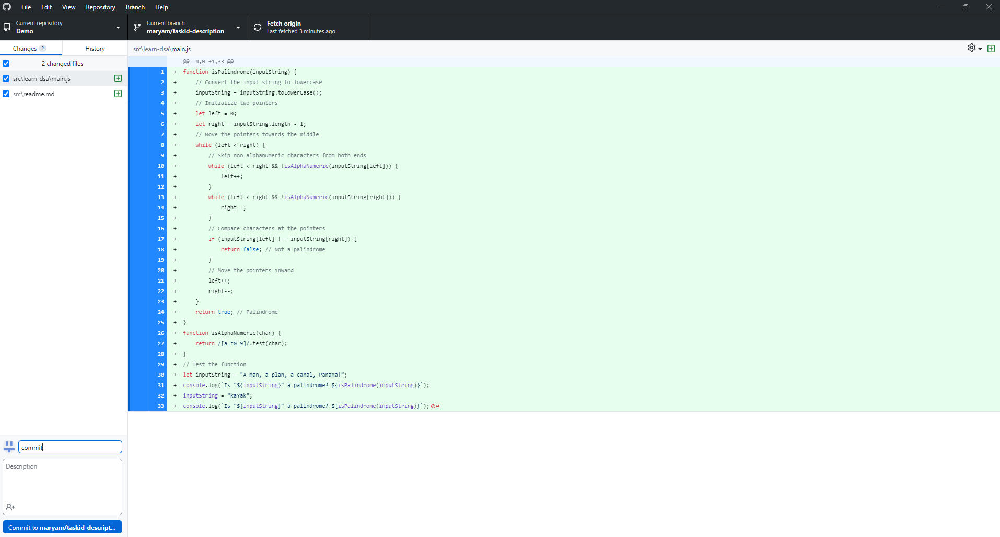

# `Session 1:` Exploring GitHub Workflow: Branch Policies, Collaboration, and Pull Requests

## Date Time: 05-May-2024 at 09:00 AM IST

## Event URL: <https://www.meetup.com/dot-net-learners-house-hyderabad/events/300759081/>

## YouTube URL: <https://www.youtube.com/watch?v=7nfah06xGkk>

---

### Software/Tools

> 1. Git for windows
> 1. Github Desktop
> 1. Visual Studio Code
> 1. Node.js

### Prerequisites

> 1. Github account

## Information


## Agenda

> 1. Creating a new repository
> 1. Adding collaborators
> 1. Setting Branch policies
> 1. Creating a new feature branch
> 1. Creating a two-pointer palindrome algorithm in JavaScript
> 1. Executing and verifying it locally
> 1. Creating Pull Requests
> 1. Code review process
> 1. Merging the feature branch into the main branch

### Please refer to the [**Source Code**](https://github.com/mygclass2020/speaker-series-2024/blob/main/documentation/S1.md) of today's session for more details

---


---

## Big picture


---

## 1. Creating a new repository

1. On the top right corner, click on **+** and select 'New repository'


2.Create your repository using the basic template


## 2. Adding collaborators

1. Go to Settings --> Collaborators, and select 'Add people'


2.Search using name, username or email to add a collaborator to your repository


## 3. Setting branch policies

1. Go to Settings --> Branches, and select 'Add branch protection rule'


2.Under 'Branch name pattern' write **main** and select 'Require a pull request before merging'


## 4. Creating a new feature branch

1. Under 'main' select 'View all branches'


2.Write a name for your branch and select 'Create new branch'

**Best Practice:**

- Name your branch using this naming convention : name/taskid-description


3.Under 'Code', select 'Open with Github Desktop' to clone locally


## 5. Creating a two-pointer palindrome algorithm in JavaScript

1. To open in VS Code, click on 'Open with Visual Studio Code'


2.Create the folder structure as shown below


3.Write this code in 'Main.js'

```js
function isPalindrome(inputString) {
    // Convert the input string to lowercase
    inputString = inputString.toLowerCase();
    // Initialize two pointers
    let left = 0;
    let right = inputString.length - 1;
    // Move the pointers towards the middle
    while (left < right) {
        // Skip non-alphanumeric characters from both ends
        while (left < right && !isAlphaNumeric(inputString[left])) {
            left++;
        }
        while (left < right && !isAlphaNumeric(inputString[right])) {
            right--;
        }
        // Compare characters at the pointers
        if (inputString[left] !== inputString[right]) {
            return false; // Not a palindrome
        }
        // Move the pointers inward
        left++;
        right--;
    }
    return true; // Palindrome
}
function isAlphaNumeric(char) {
    return /[a-z0-9]/.test(char);
}
// Test the function
let inputString = "A man, a plan, a canal, Panama!";
console.log(`Is "${inputString}" a palindrome? ${isPalindrome(inputString)}`);
inputString = "kaYak";
console.log(`Is "${inputString}" a palindrome? ${isPalindrome(inputString)}`);
```

## 7. Creating Pull requests

1.Alternatively, in Github Desktop enter a commit message and commit your changes



3.Click on 'Preview pull request' and create a pull request


## 8. Code review process

1. Under 'Reviewers' add a reviewer and create a pull request


## 9. Merging the feature branch into main branch

1. Merging will be blocked till reviewed by one person due to branch policies


---

## X. SUMMARY / RECAP / Q&A

> 1. SUMMARY / RECAP / Q&A
> 2. Any open queries, I will get back through meetup chat/twitter.

---
