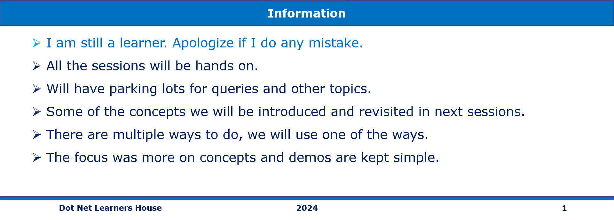

# `Session 1:` Getting started with Algorithmic Complexity

## Date Time: 08-Jume-2024 at 09:00 AM IST

## Event URL: <>

## YouTube URL: <>

## Information



## Agenda

> 1. Introduction to Algorithmic Complexity
> 1. Algorithmic Complexity Notations
> 1. Big Omega (Ω), Big Theta (Θ), Big O (O)
> 1. Understanding Big O Notation
> 1. Big O (O) Basic Concepts
> 1. Common Time Complexities
> 1. O(1): Constant Time
> 1. O(n): Linear Time
> 1. O(n): Linear Time
> 1. O(n^2): Polynomial Time

### Please refer to the [**Source Code**](https://github.com/mygclass2020/speaker-series-2024/blob/main/documentation/S2.md) of today's session for more details

---


---

## Big picture


---

## 1. Understanding Big O Notation

### 1.1. Big O (O) Basic Concepts

> 1. **Definition:** Big O notation represents the upper bound on the running time or space complexity of an algorithm.
> 1. **Purpose:** It helps us understand how an algorithm’s performance scales as the input size grows.
> 1. **Example:** If we say an algorithm has a time complexity of O(n), it means that the worst-case running time grows linearly with the input size.
Use Case: Big O is often used to analyze the worst-case scenario.

### 1.2. Common Time Complexities

#### 1.2.1. O(1): Constant Time

> 1. **Description:** Algorithms with constant time complexity execute in a fixed amount of time, regardless of the input size. They are highly efficient.
> 1. **Example:** Accessing an array element by its index.

**Sample codes:**

```python
# Python
def access_element(arr, index):
    return arr[index]
```

```javascript
// JavaScript
function accessElement(arr, index) {
    return arr[index];
}
```

#### 1.2.2. O(log n): Logarithmic Time

> 1. **Description:** Logarithmic time complexity indicates that the
divides the problem into smaller parts in each step (`divide and conquer`). It's efficient for large datasets.
> 1. **Example:** Binary search.

**Sample codes:**

```python
# Python
def binary_search(arr, target):
    left, right = 0, len(arr) - 1
    while left <= right:
        mid = left + (right - left) // 2
        if arr[mid] == target:
            return mid
        elif arr[mid] < target:
            left = mid + 1
        else:
            right = mid - 1
    return -1
```

```javascript
// JavaScript
function binarySearch(arr, target) {
    let left = 0;
    let right = arr.length - 1;
    while (left <= right) {
        const mid = Math.floor((left + right) / 2);
        if (arr[mid] === target) {
            return mid;
        } else if (arr[mid] < target) {
            left = mid + 1;
        } else {
            right = mid - 1;
        }
    }
    return -1;
}
```

#### 1.2.3. O(n): Linear Time

> 1. **Description:** Linear time complexity means the running time grows linearly with the input size. It's `proportional` to the data set size.
> 1. **Example:** Looping through an array.

**Sample codes:**

```python
# Python
def linear_search(arr, target):
    for i in range(len(arr)):
        if arr[i] == target:
            return i
    return -1
```

```javascript
// JavaScript
function linearSearch(arr, target) {
    for (let i = 0; i < arr.length; i++) {
        if (arr[i] === target) {
            return i;
        }
    }
    return -1;
}
```

#### 1.2.4. O(n^2): Polynomial Time

> 1. **Description:** Polynomial time complexity involves `nested loops` for each power of n. It's less efficient for large datasets.
> 1. **Example:** Bubble sort (O(n^2)).

**Sample codes:**

```python
# Python
def bubble_sort(arr):
    n = len(arr)
    for i in range(n):
        for j in range(n - i - 1):
            if arr[j] > arr[j + 1]:
                arr[j], arr[j + 1] = arr[j + 1], arr[j]
```

```javascript
// JavaScript
function bubbleSort(arr) {
    const n = arr.length;
    for (let i = 0; i < n; i++) {
        for (let j = 0; j < n - i - 1; j++) {
            if (arr[j] > arr[j + 1]) {
                [arr[j], arr[j + 1]] = [arr[j + 1], arr[j]];
            }
        }
    }
}
```
